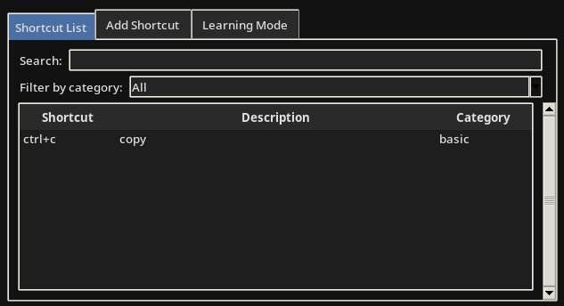

# Keysnap
A desktop app designed to help you master keyboard shortcuts



## Features
- Add, edit, and delete keyboard shortcuts
- Organize shortcuts by category
- Search and filter shortcuts
- Persistent storage of your shortcuts
- Quiz difficulty levels
- Right click on list element to view delete button

## Requirements
- Python
- Tkinter

## Setup
1. **clone repo**  
   `git clone https://github.com/mzums/keysnap`  
2. **run**  
   `python main.py`

## RAM Optimization Techniques

1. **`__slots__` in classes**  
   ```python
   class ShortcutManager:
       __slots__ = ('filename', '_shortcuts', '_categories')
   ```
   - replaces dynamic `__dict__` with fixed attribute lists

2. **Memory pooling for categories**  
   ```python
   if category not in self._categories:
       self._categories.append(category)
   category_idx = self._categories.index(category)
   ```
   - stores category strings once and reuses them

3. **Tuple-based data storage**  
   ```python
   self._shortcuts.append((shortcut, description, category_idx))
   ```
   - more memory-efficient than dictionaries/objects

4. **Binary storage with fixed-size records**  
   ```python
   f.write(struct.pack('II', len(self._shortcuts), len(self._categories)))
   ```
   - more compact than text formats (JSON/XML)

5. **Lazy loading for quiz data**  
   ```python
   def refresh_available(self):
       self.available_shortcuts = self.app.manager.get_shortcuts()
   ```
   - only loads quiz data when needed

6. **Selective UI updates**  
   ```python
   self.app.list_frame.refresh_list()
   self.app.quiz_frame.refresh_available()
   ```
   - updates only necessary components

7. **Efficient string handling**  
   ```python
   self.shortcut_var = tk.StringVar()
   ```
   - uses Tkinter's optimized string management

8. **Pre-display data filtering**  
   ```python
   for item in self.app.manager.get_shortcuts(category):
       if search_term in shortcut.lower()...
   ```
   - avoids storing invisible items in GUI widgets
